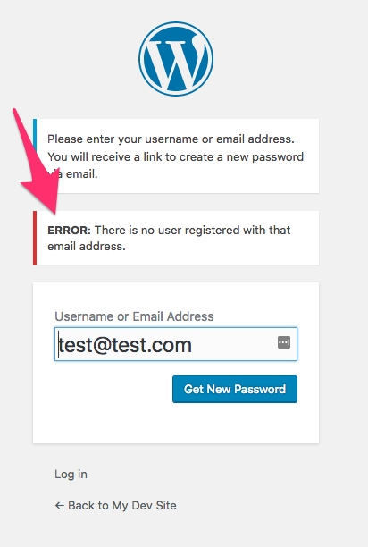

# What To Do When You Forget Your Password

## Description

In this lesson you will learn how to log into your WordPress site using a username and a password. You will also learn how to recover your password by email if it is lost.

## Objectives

After completing this lesson, you will be able to:

*   Gain access to a WordPress site if your user password is lost.

## Target Audience

Who is this lesson intended for? What interests/skills would they bring? Choose all that apply.

* [x] Users
* [ ] Designers
* [ ] Developers
* [ ] Speakers
* [ ] All

## Experience Level

How much experience would a participant need to get the most from this lesson?

* [x] Beginner
* [ ] Intermediate
* [ ] Advanced
* [ ] Any

## Type of Instruction

Which strategies will be used for this lesson plan? Choose all that apply.

* [x] Demonstration
* [ ] Discussion
* [x] Exercises
* [ ] Feedback
* [x] Lecture (Presentation)
* [ ] Show & Tell
* [ ] Tutorial

## Time Estimate (Duration)

How long will it take to teach this lesson (in minutes)?

30 minutes

## Prerequisite Skills

You will get the most from this lesson if you have familiarity with:

*   Basic computer skills

## Readiness Questions

*   Do you have a WordPress site or are you a user on a WordPress site?
*   Have you previously logged onto this site with a password?
*   Do you have an email address to which this WordPress site is linked?

## Materials Needed

*   A WordPress site to demonstrate with (consider a local install).

## Notes for the Instructor

*   Performing a live demo and/or having students logging in to their WordPress site during the lesson will be helpful in their understanding.
*   A live install of WordPress should work fine for this lesson. A local install is also acceptable.

## Have You Thought About...?

What could present challenges to delivering this lesson? Is there anything that can be done in advance to prepare for those challenges?

*   Participants may not have access to the email account that the password reset message was sent to.
*   Many people have multiple email addresses. It can be difficult to keep track of which email address has been used for a particular site. If you get an error message with one email address, try another.
*   If you are using a local installation, have you tested the password reset functionality? Your local installation may not be able to send mail, or it may arrive marked as Spam.

## Lesson Overview

*   Demonstrate how to get to the WordPress login screen
*   Demonstrate the "Lost your password?" link
*   Use the password reset email to change the password
*   Confirm the new password

## Exercises

**Reset Your Password**

* For an existing account on a WordPress site, reset the Password

**Know Where to Get Help**

*   If you haven't already, sign up for the WordPress Support Forums: [https://wordpress.org/support/register.php](https://wordpress.org/support/register.php)

## Assessment

**What is added to the end of your site URL, to log into your site?**

1.  /wp-login.com
2.  wp-login.php
3.  /wp-login.php
4.  /login.php

**Answer:** 3\. /wp-login.php (includes the slash and is a PHP file).

**A "nonce" is:**

1. Password management system
2. Single-use password generator link
3. Strong password generator
4. Photo square in the upper right hand corner of your site

**Answer:** 2\. Single-use password generator link

## Additional Resources

* None

## Lesson

### Go to the WordPress Login Screen

> By default, you can login to a WordPress site by going to the `/wp-login.php` path. For example, if we forgot our password to the WordPress Support Forums, we could go to [https://login.wordpress.org/wp-login.php](https://login.wordpress.org/wp-login.php). 

1. Go to your WordPress site.  
2. Add ```/wp-login.php``` to the end of the site URL and press enter. You will be taken to the login page, which looks like this: 


### Initiate the Password Reset Email

1. At the bottom of the page, there is a link titled "Lost your password?". Click the "Lost your password?" link. You will be taken to a new page, which looks like this: 


2. Enter your user name or email address. It is easiest to specify your email address in order to know which email account to check for the password reset email. Click the "Get New Password" button after entering your email address.

#### If Something Went Wrong

After entering your email address, you may get this message:

  

* This message will appear if the email address provided is not associated with a user account on the WordPress site.
* Try entering a different email address that might be associated with the site. Or, contact the site administrator to ensure you have a user account.

### Locate the Password Reset Email

* After clicking "Get New Password," an email will be sent to you within a few minutes.  The message will look like this:

  

This email includes your username. *Please take note of the user name in the email.*

* There will also be a link at the bottom of the email.
  * The link uses a one-time key called a "nonce."  A nonce is a very secure way to generate password reset links.  
  * __The link will only work once.__  If you need to reset your password again, you will need to go back to the first step in this lesson and generate a new email.

### Use the Link in the Password Reset Email to Reset the Password

Click the link at the bottom of your email. You will be taken to this page: 

  

Here, you will set a new password. After deciding on a new password and entering it into the field, click "Reset Password" and you're done!

### Confirm the New Password

After resetting your password, it is a good idea to double check that it works. Hover over the photo square in the upper right hand corner of your screen and click on "Log Out" when the menu appears.


*  Go back to the login page (ending in wp-login.php) and enter your user name (which you saw in the Password Reset email) and your new password.

2. If your log in attempt does not work, double check the user name by comparing what you had entered into the login form with the user name from your email. __When in doubt, copy and paste the user name from the email directly.__ Make sure you typed the password correctly. If you've generated your password through a site and still have that window open, copy and paste the password. Alternatively, if you're using a password management utility, copy and paste the password.

It is a good idea to be able to reset your password before you need to do so. Here are the steps you can take to make sure you have first-hand experience before you lose an important password.

*   If you haven't already, sign up for the WordPress Support Forums: [https://wordpress.org/support/register.php](https://wordpress.org/support/register.php)
*   Follow the steps to reset your password as outlined in this lesson.

### Lesson Wrap Up

>  Follow with exercises and assessment outlined above.
